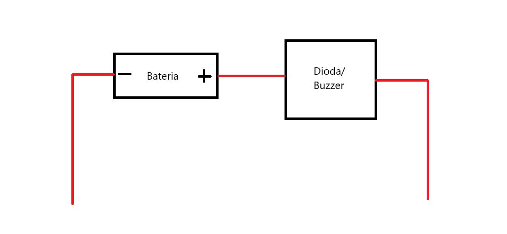
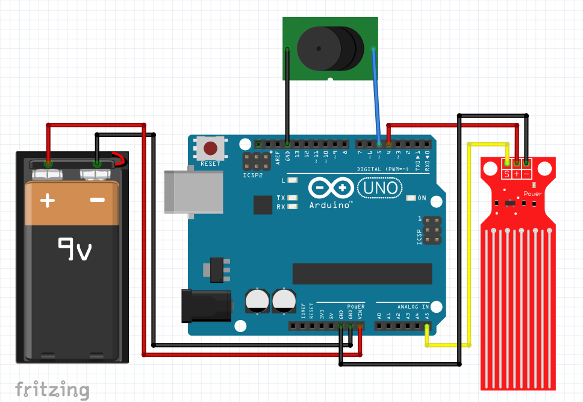

# Rozwiązanie(a) zadania 1

Poniżej przygotowane zostały rozwiązania do powyższego zadania

## 1. Najtaniej

Do wykonania rozwiązania potrzebne są:

- kijek dłuższy od wysokości garnka

### Rozwiązanie:

Łamiesz Kijek z dwóch stron tak żeby był na taką wysokość jak solnik, zostawiasz Kijek i jak wrócisz i się nie zgadza wysokość to Marcinek upija solnik. No ale hola hola, co jak Marcinek użyje kilku szarych komórek doda dwa do dwóch i ogarnie po co był Kijek?

I tu przychodzi dlaczego Kijek łamaliśmy z dwóch stron: zabierzemy ułamane końce ze sobą - nie muszą być długie, więc możemy je nosić przy sobie. Jak podjedziemy sprawdzić czy Marcinek podpinał solnik i wysokość będzie się zgadzała z kijkiem ale końcówki kijków się nie będę zgadzały to Marcinek ma problem.

### Zalety:

- Tanie - prawie darmo, tylko znajdź badyla
- Proste

### Wady:

- Do czasu sprawdzenia przez Domino, czy Marcinek podpija solnik, może już go nie być.
- Niezbyt mądry Domino może zgubić końcówki kijka.

## 2. Prosta Technolodżia

Do wykonania rozwiązania potrzebne są:

- Bateria
- Buzzer/Dioda
- Przewody

### Rozwiązanie

Połącz baterię i buzzer/diodę tak jak na rysunku.

Zanurz przewody by były delikatnie pod powierzchnią tafli solnika. Buzzer będzie grał/dioda świecić jeżeli poziom solnika spadnie poniżej zanurzonych przewodów.

### Zalety

- Proste
- Tanie (ale nie najtańsze)

### Wady

- Marcinek może się skapnąć i zanurzyć przewody głębiej
- Jeśli użyjemy buzzera, to będzie nawalał cały czas.
- Bateria może się szybko wyczerpać
- Przewody mogą skorodować od solnika

## 3. (Mniej) Prosta Technolodżia

Do wykonania rozwiązania potrzebne są:

- Arduino Uno (lub inny mikrokontroler z analogowymi wejściami - ale kod może nie działać)
- Czujnik poziomu cieczy _SE045_ lub podobny
- Buzzer
- Bateria 9V
- _Dioda LED (Opcjonalnie)_

### Rozwiązanie

Zmontuj układ zgodnie z układem poniżej:

Włóż czujnik poziomu cieczy do garnka tak, by zanurzona była część z prążkami. Włączając urządzenie sensor skalibruje się i odczyta poziom solnika. Jeśli poziom solnika spadnie, buzzer się uruchomi i dioda led zacznie się świecić.

### Zalety

- Prostota (jak na urządzenie)
- Cena (Arduino UNO to koszt na ali ~5$ + czujnik, buzzer, bateria ~3$)
- Odstraszy Marcinka i na pewno powiadomi Domino

### Wady

- Sensor do badania poziomu wody może i jest tani, ale również jest podatny na korozję (solnik ma sól)
- Sensor do badania poziomu wody może i jest tani, ale za to mało dokładny. Ruszenie garnkiem lub jego przechylenie wpłynie na wyniki.
- Domino musiałby mieć na tyle szarych komórek, by dobrze podłączyć urządzenie.

### Miejsce na poprawę

Można by było wykorzystać inny sensor, np. sensor ultradźwiękowy lub ciśnieniowy. Będą dokładniejsze, jednak droższe. Można użyć tańszego mikrokontrolera, nie potrzebujemy pełnej mocy potężnej Atmegi.
