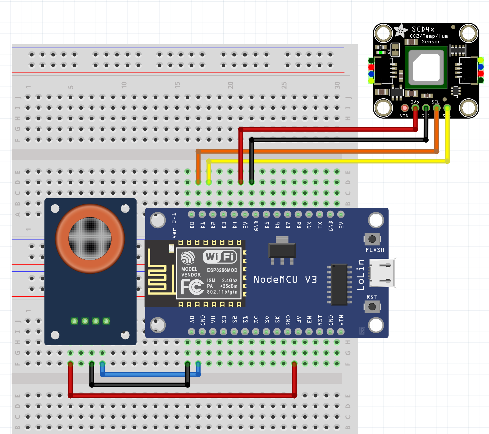

# Rozwiązanie zadania 2

Prezes Solvro potrzebuje urządzenia, które sprawdzi, czy jakość powietrza w pomieszczeniu w którym przebywa jest jeszcze znośna. Jeśli nie jest, to trzeba przemówić mu do rozsądku. Urządzenie więc wyśle prezesowi wiadomość na discordzie z informacją, że ten powinien otworzyć okno, z danymi dotyczącymi jakości powietrza, oraz z krótkim ostrzeżeniem w oparciu o Indoor Air Quality Index (IAQI) - bo jak się siedzi na komputerze, to wiadomość na discordzie będzie dobrym sposobem na doinformowanie zapracowanego człowieka

## Mierzone parametry

- Stężenie dwutlenku węgla (CO2)
- Stężenie alkoholu, benzenu, amoniaku
- Temperatura, wilgotność i ciśnienie

## Wykorzystane części

- ESP8266 (NodeMCU)
- SCD40
- MQ-135

## Rozwiązanie

Zmontuj układ zgodnie z układem poniżej:

Zmodyfikuj kod programu o:

- SSID i hasło do WiFi
- Wygenerowany URL do webhooka discord
- Możliwe, że potrzebna będzie kalbracja sensora MQ-135
